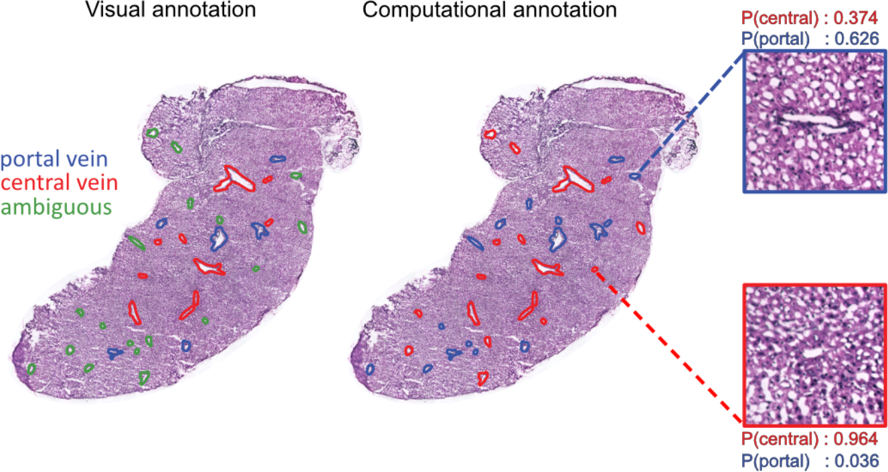

I'm thrilled to announce that a collaboration with my good friend and colleague,
[Franziska Hildebrandt](https://orcid.org/0000-0002-2673-1704), now has matured
to the state of being ready for journal submission, which also coincides with a
pre-print upload to
[bioRxiv](https://www.biorxiv.org/content/10.1101/2021.01.11.426100v1).

The pre-print is titled _"Spatial Transcriptomics to define transcriptional
patterns of zonation and structural components in the liver"_, and focus on the
application of ST2K (similar to the old legacy ST1K and the newer Visium
platform). It is the first time that ST (Spatial Transcriptomics) has been
applied to the mouse liver, and aims to show how the technique enables the liver
to be explored from new, different and illuminating perspective. A lot of
standard analysis, such as clustering and identification of differential genes
(DEGs) are presented in the paper and show affirmative results, attesting to the
(experimental) method's ability to delineate regions with various expression
profiles (often overlapping well with morphological structures).

My contribution to this paper was nevertheless slightly different and consisted mainly of two parts:

* Construction of a framework to model feature signals as a function of the distance to a given object.
* Development of a classifier to predict _vein type_ (a binary classification
  task) based on the expression profiles surrounding a certain genes.
  
Both concepts are excellent examples of analyses that are exclusive to spatial
data, i.e., similar information cannot be obtained from single cell experiments;
something I'm keen to highlight, as it is often the case that one fails to make
proper use of the "spatial" part in spatial transcriptomics data, and rather treat it as single
cell data, to then visualize the results spatially. Both implementations are very
simple, but I have not seen similar analyses in ST or Visium data yet, of course
that could be due to me not having surveyed the field thoroughly enough, but
still. Allow me to elaborate some on these two concepts below.

### Feature by distance
In the liver tissue one can broadly classify vein structures as either _portal_
or _central_ based on their position and connections. Previous studies have
shown that these structures are associated with slightly different expression
profiles, as different celltypes (periportal respective pericentral
hepatocytes) are present in them.

What we did in this study was to first "measure" the distance of each spot
(spatial capture location) to the nearest vein (of respective type), and then
for each gene create a set of distance-expression tuples that could be
visualized in a scatter plot. While these values are discrete, once a curve
smooting techniques is applied we can easily think of the resulting curve as a
function that maps *distance to gene expression*. By doing so one could
really see how the associated marker genes (to each vein) had a high expression
near their respective vein, and how this decreased as distance increased
(inverse relationship). You can see some examples of these trends in the plots 
below, top row displays portal vein marker genes, bottom central:

### Classification of vein types by expression
Now, while pathologists and experts in the field usually are able to annotate
each vein type by visual inspection (this is how we obtained the annotations
used for the feature by distance plots), there are sometimes ambiguities and
limited access to such individuals. However, the expression profiles of portal
and central veins should be the similar for all veins of the same type,
independent of whether identity is easy to deduce from morphology or not.
Hence, by creating _neighborhood expression profiles_ (NEPs) surrounding each
vein, and training a classifier (actually logistic regression) using NEPs from 
veins with known identities; we were able to predict vein type of ambiguous
veins. During cross-validation (leave one _sample_ out) the model also performed
very well with higher than 80% accuracy.

To read more about the study, check out the manuscript
[here](https://www.biorxiv.org/content/10.1101/2021.01.11.426100v1), and the
Python package we released (_hepaquery_) to perform similar analyses with any
type of spatial transcriptomics data at the
[github](https://github.com/almaan/ST-mLiver) page.

I'm very happy to have worked with a nice team with complementary 
biology and computational skills, this really resulted in a neat manuscript;
also a big kudos to the first author Franziska, who pushed very hard in the end
to finalize this project.
