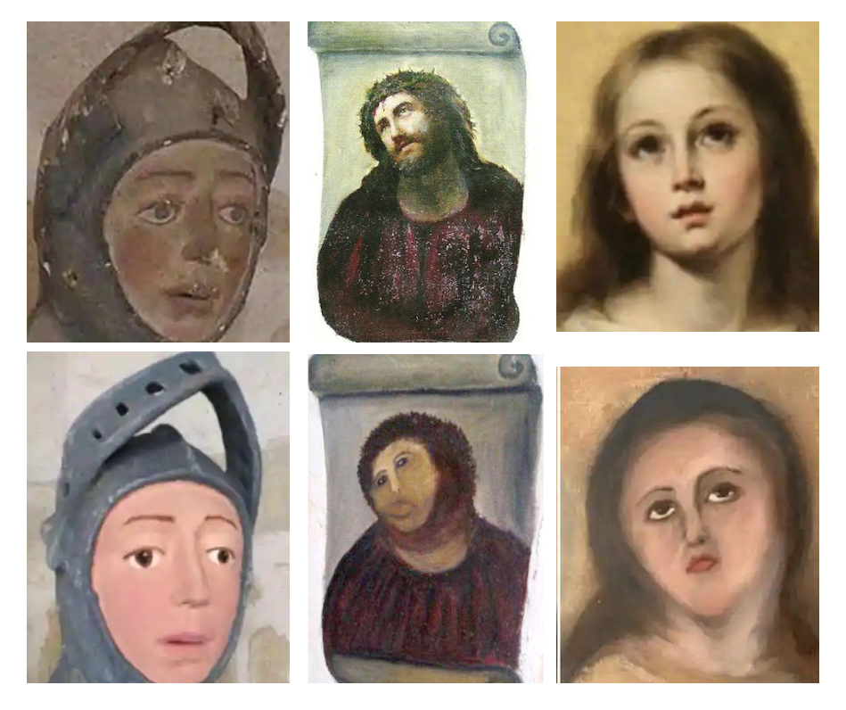

For quite some while now, I've carried a slight sensation of guilt within me.
Guilt for being so caught up in my own projects and activities that I've come to
neglect one of the most essential duties as a researcher: to survey, read, and
contemplate upon new (and old) material that have been published. It's so easy
to put that interesting paper aside in order to finish a project deadline, as no
immediate gains are observed from reading through the former in contrast to
completing the latter. Once a habit, this behavior efficiently imprints the idea
that "making" is more important than learning; this might give a false sense of
efficiency at first, but (I believe) has a severe negative impact on the quality
and creativity of one's work in the long run. How am one supposed to grow and
expand the knowledge sphere if one never travels beyond its borders? Hence, I've
somehow managed to conjure a vision of myself being a more active ~~reader~~
gatherer of information this year by committing to the task of doing bi-weekly
paper reviews, starting today. I should say here, that these reviews will mainly
be focused on _summarizing_ the material presented, rather than _evaluating_
them; but of course, if I have opinions or comments which I deem relevant, these
will be shared as well. My hope is to continue this at least throughout the
year, to then evaluate and reassess whether its an endeavor worth continuing.
Alas, let's get started.

**Paper Title :** _Toward a Common Coordinate Framework for the Human Body_

**Authors :** _Jennifer E. Rood, Tim Stuart, Shila Ghazanfar, Tommaso
Biancalani, Eyal Fisher, Andrew Butler, Anna Hupalowska, Leslie Gaffney, William
Mauck, Gökçen Eraslan, John C. Marioni, Aviv Regev, Rahul Satija_

**Published :** 12-12-2019

**doi :** https://doi.org/10.1016/j.cell.2019.11.019

**Review :** In ambitious projects like the [Human Cell
Atlas](https://www.humancellatlas.org/) we often rely on joint efforts from
multiple labs, as well as collection of data across multiple individuals, ages,
phenotypes, both sexes and plenty of other features. This strategy is very apt
for producing _large and diverse_ datasets; but unless we somehow harmonize and
integrate all of the data into a common framework it will be nothing more than a
big mess that is ought to bring more headaches than joy. The
authors of this paper discuss these issues in terms of a **common coordinate framework**
which they - very neatly - define as a reference map that can : "_[..] assign a
reproducible address to every location_". CCFs can be constructed at different
scales (macro, meso, micro and fine are used as examples here), but its purpose
always remains the same, to relate regions in independent samples in a shared context.

Personally, I think it's easiest to motivate the need of a CCF through an
analogy. Imagine you have a set of portraits, painted by different artists. Some
paintings depict the same individual, but not all of them. An example of this
scenario is illustrated below:

Now, if we wanted to assess how skilled each painter was at recreating certain
facial features (e.g., eyes or noses), we must somehow identify these different
parts in each of the pictures before we could speak of comparing them. However,
it's insufficient to only compare the images pixel-by-pixel as we have several
different motifs. Somehow, we need to use the _common_ features of a face, to
identify the _unique_ elements of each artist. Similarly, when building an atlas
of the human body, organs or sub-region of an organ using data from multiple
sources, we need to know where each piece fits into the larger picture. A CCF
would further enable a very precise exploration of variation across individuals,
and is obviously a fundamental tool in any quest to study heterogeneity.

In the paper they discuss some of the challenges associated with the
creation of a CCF, and consider the inherent anatomical diversity across
individuals as perhaps the most prominent one. They also bring up a good point
about how consistent annotation (used to assemble the CCF) is not as
straightforward of a task as it might seem, since biological compartments and structures do not
always have well-defined boundaries. Another challenge in devising methods to
construct CCFs arise from the fact that a sample's character by and large
dictates how appropriate a certain method is. To illustrate this, two extremes
are given as examples: (1) when anatomical regions are highly similar across all
samples (e.g., early stages of embryogenesis), and (2) when cells are
(seemingly) randomly organized (for example in a tumor). Of course, these two
extremes represent end-points on a continuum, and most samples place somewhere
in-between the two. For samples more like (1) leveraging the consistency and _a
priori_ knowledge is preferable, while for samples like (2) one would instead do
better by employing data-driven methods where the locations are learnt from the
data. Of course, in both scenarios it is appealing to envision a form of
Bayesian approach, where we update our beliefs regarding a sample's location as
more data is gathered.

Different variants of CCFs exist, three broad classes are
given in the paper: using Anatomical Plane Coordinates, Landmark based
construction and complex non-standard approaches. The first (anatomical plane
coordinates) more or less aligns samples by registration to a reference (to account for
inter-specimen variation). It uses a standard coordinate axis as the reference
point to which distances are measured. One huge benefit is that distances
between objects in this space, represent true distances. The landmark
based approach is more or less an extension of the anatomical plane coordinates,
but where one uses known landmarks (e.g., a vein bifurcation or a certain axon
bundle) rather than anatomical planes. These landmarks allow one to anchor
points in different samples to a reference. Having identified the landmarks, one
may then apply a linear transformation to map a query image to the reference.
For both the aforementioned strategies, the use of a _reference_ is
essential - the template itself may however be updated iteratively as the process
progress. The complex non-standard approaches are used when there's a lack
of anatomical structure or when no clear landmarks can be identified. In complex
approaches, local non-linear (in contrast to the other methods) warping is
applied to account for large anatomical variation.

Now of course, as you might have noted, both of the two first methods relies on
a reference template. Hence the question of how such a template is
obtained, to which the authors answers that it depends largely on the sample.
For **highly stereotypical** samples, a successful approach has been to use an
iterative process, starting with a seeding set to which the whole dataset is
aligned, a new reference is then extracted and used as a seed
in the next iteration; a procedure repeated until convergence. To
overcome the inter-individual variability in samples with "_similar
inter-individual organ structure but differences in cell type location and organ
dimensions_" a certain degree of supervision was added to the procedure; by
manual annotation of landmarks etc. Semi-supervised processes are also predicted
to be of great use in the construction of a human atlas. For highly
**non-stereotypical** samples, there were no good strategies for template
construction at the date of their writing, and they mention how this will have
to be remedied by new methodological developments.

Interestingly the authors highlight a fourth orthogonal, and fairly
unconventional, approach that discards the use of a _pre-defined_ coordinate
system, landmarks and templates, in favor of learning it from the data itself.
Multiple examples of methods for spatial reconstruction (see Seurat v3
and novoSpaRc) can be seen as testimonies to spatial information being contained
within the expression profiles of cells. To me, this is very similar to the SLAM
problem in robot localization, where one tries to create the map while also
finding ones current position within it.

They also discuss how, once a CCF is established, samples of the same and
different modalities may be mapped to it. If we are operating with data of the
same modality, the process should be nothing but straightforward. We simply use
the same strategy as when creating the CCF itself. For other
cross-modality-mapping the case is slightly different, and integration will only
be possible if the assumption that both modalities shares a latent
representation (e.g., chromatin accessibility) holds.

Now, one idea that the authors introduce, and which according to them is novel
(I can find nothing that would contradict the claim) is that given all these
challenges and how much influence a sample's character has on the choice of
method, is to dismiss the objective of creating a single CCF. Instead, multiple
CCFs should be created in a hierarchical (by scale) fashion, which would allow
both horizontal and vertical movements across the atlas, but where each CCF is
adapted to best fit the data. This would represent a sort of "atlas of atlases"
as they express it. To me, this makes perfect sense, although it would
have been interesting to see some more discussion of how the vertical movements
(between scales) were envisioned.

Their conclusions are brief, and so shall mine be. They make a strong argument
for the value of CCFs, and why they deserve our attention.
Inter-individual variability is the biggest hurdle to tackle, but there are
strategies for it, though highly dependent on the data; this is not a "one-size
fits all" type of problem. When the data is complex and we can't establish
natural anatomical templates or find good landmarks, perhaps it's better to let
the data dictate its own reference, using approaches inspired from methods of
spatial reconstruction. All in all, CCFs brings structure to a very chaotic and
seemingly unstructured space - and they are imperative to the process of
creating a unified atlas of the human body.

