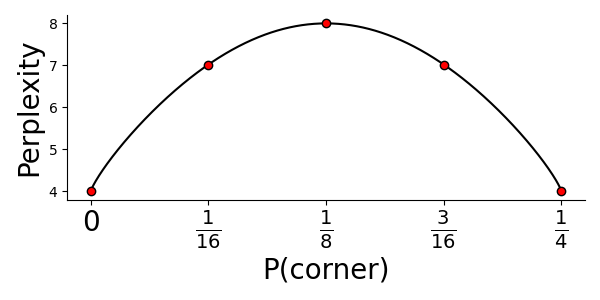
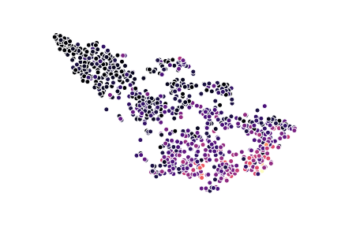

Having covered two somewhat old papers -- at least by our field's standards --
in the previous reviews, my idea was to select something a bit more "up to date"
this time. The path from this ambition to ending up reviewing a 13 year old
paper is not obvious, but also not completely random. The t-SNE technique that
van der Maaten and Hinton (yes it's _the_ [Hinton](https://en.wikipedia.org/wiki/Geoffrey_Hinton)) presented more than a decade ago is still widely used and continues to spur 
discussion. In 2019 [Becht
et.al](https://www.nature.com/articles/nbt.4314) made an argument about UMAP's
(Uniform Manifold Approximation and Projection) superiority to other methods for
dimensional reduction, including t-SNE, when working with single cell transcriptomics data. And early this February (01-02-2021),
[Kobak et.al](https://www.nature.com/articles/s41587-020-00809-z). presented a
*Matters Arising* from Becht.et.al. where they argue that t-SNE is not inferior
to UMAP when it comes to preserving global structure, **if the two methods are
initialized by the same procedure**. New methods, heavily influenced by t-SNE,
continue to emerge; for example
[this](https://www.biorxiv.org/content/10.1101/2020.07.17.207993v1.full)
variatonal autoencoder by Graving and Couzin. The t-SNE paper has $17996$
citations (2021-02-20, Google Scholar), and would probably have more, had it not
become so widely known that people stopped citing it (and rather cites the
analysis suites used to apply it). To put that number into context, that's about
4 citations a day, every day since published. With such an important paper, the
temptation to review it became too large, and so here we are.

**Paper Title** : Visualizing Data using t-SNE
 
**Authors** : Laurens van der Maaten and Geoffrey Hinton
 
**Published** : November 2008
 
**Link** : [JMLR](https://www.jmlr.org/papers/v9/vandermaaten08a.html)
 

In short, this paper presents a technique for dimensionality reduction that is
specifically designed to offer better visualization of high dimensional data
while also requiring less parameter tuning and being competitive
performance-wise. The method, t-SNE (t-distributed Stochastich Neighborhood Embedding), is
actually a modification an the earlier SNE (Stochastich Neighborhood Embedding)
method, proposed in 2002 by Hinton and Roweis and designed for the same purpose. SNE
however, the authors argue, constructs fairly good visualizations of high
dimensional data, but has two big
drawbacks : (1) It does not allow for convex optimization, and has a
inconvenient cost function which is sensitive to hyperparameter choice; (2) it
suffers from what the authors call a "crowding" problem (more on this later).

They also mention, and compare, t-SNE to seven other methods for dimensionality
reduction. One of the authors main motivations for developing t-SNE was that the
currently available techniques failed to perform well on real world data. Linear
techniques are know for being notoriously bad at maintaining close local
relationships between data points, rather focusing on placing distant points far
away. The pre-existing non-linear techniques sought to remedy this, but failed
to preserve *global and local* structures when applied to real (noisy) data,
even though performing well on artificial data.

The authors first present the older SNE technique to then discuss what sets
t-SNE appart from this, a setup that I will follow as well. For convince, 
the same notation as the authors will be used: $x_i$ denotes data points in the higher
dimensional space, $y_i$ in the lower dimensional space. Note, the $x_i$ values
constitute our original data, the $y_i$ values are unknown, and what we seek to
find the best fit for given our stated objective. We will also speak about
probabilities, here $p$ and $q$ will be associated with high and low dimensional
space respectively. As a final note, the authors use the terms _"conditional"_
and _"joint"_ probabilities in a kind of sloppy way, but I will keep their
terminology for the sake of easy referencing.

Now, the core concept in SNE/t-SNE is to first think of "closeness" between two data
points in terms of how likely they are to pick each other as *neighbors*; a
point _could_ any pick another point as it's neighbor, but the *probability* of these
events differs. Then, we try to make the distributions over neighbors as similar
as possible in high and low dimensional space, mathematically translating to
minimizing their Kullback-Leibler Divergence (KLD).

In SNE the conditional probability that point $i$ would pick point $j$ as
it's neighbor is written as $p_{j|i}$ in high dimensional space, and $q_{j|i}$ in
low dimensional space, with:

$$
\begin{array}{ll}
&p_{j|i} = \frac{\exp(-||x_i - x_j||^2 / 2\sigma_i^2)}{\sum_{k\neq i} \exp(-||x_i -
x_k||^2/2\sigma_i^2)},\quad p_{i|i} = 0 \\\\
&q_{j|i} = \frac{\exp(-||y_i - y_j||^2 )}{\sum_{k\neq i} \exp(-||y_i -
y_k||^2)},\quad q_{i|i} = 0
\end{array}
$$

The value $\sigma_i$ is indiricely determined by the user and the data. The user provides a
desired perplexity value ($\rho$). Once the perplexity is given $\sigma_i$ is
given by the value that gives:

$$
\rho = 2^{H(P_i)}, \quad H(P_i) = - \sum_j p_{j|i}\log_2 p_{j|i}
$$

The $H(P_i)$ function is as you might notice the _entropy_ of the neighborhood
distribution for point $i$. Entropy can be interpreted in many ways, but here
it's helpful to think of it as the "peakiness" of your distribution, i.e.,
whether the probability mass is evenly spread or just found at a few
concentrated sites. Meaning that, with a higher perplexity we have a higher
entropy and the probability of picking a neighbor is more spread out, i.e., we
expect more neighbors. In fact, the perplexity can be thought of as an estimate
of the expected number of neighbors each point has, to see why this is, imagine
you have nine points in a $3\times 3$ grid, and the probability of that the
center point $i$ picks one of the eight points as it's neighbor is set to: $0$ for the
corner points and $1/4$ for the remaining ones. Then the perplexity becomes:

$$
P(P_i) = 2^{-H(P_i)}= 2^{-(4\cdot 0 + 4\cdot 0.25 * \log_2 0.25)} = 2^{1\cdot\log_2(4)} = 4
$$

Which makes perfect sense, since we said that the center point only could pick
the four non-corners as it's neighbors. Actually, we could even plot the
perplexity as a function of the corner points probability value:

The number of expected neighbors will then obviously be largest if all points
have equal probability (that is, $\frac{1}{8}$). For **t-SNE** the authors
recommend to use perplexity values between 5-50, but this is highly dependent on
the data.

Having clarified how we calculate $\sigma_i$ and what the perplexity is, you
might now ask why is there no $\sigma$ in the definition of $q_{j|i}$? In fact
there is, but it's static and set to $1/\sqrt{2}$. Hence ,since $(1/\sqrt{2})^2
\cdot 2 = 1$ we end up with the above expression for $q_{j|i}$.

So why are we using these forms for the conditional probabilities then? Well, the
observant reader have probably noted the similarity of the probabilities to the pdf
(probability density function) of the Univariate Gaussian. And indeed, there is
a relationship between the two. The conditional probabilities above represent: _"the probability that point
$i$ would pick point $j$ as its neighbor
if neighbors were picked in proportion to their probability density under a
Gaussian centered at point $i$."_. This is makes sense, but has one disadvantage;
the conditional probabilities (defined as above) are not symmetric, meaning that
in general $p_{j|i} \neq p_{i|j}$ (and the same for $q$). And why does this
matter again? Well, it renders a cost function ($C$) that is hard to optimize:

$$
\begin{array}{l}
&C = \sum_i KL(P_i||Q_i) = \sum_i\sum_j p_{j|i}\log \frac{p_{j|i}}{q_{j|i}}\rightarrow\\\\
&\rightarrow \frac{\partial C}{\partial y_i} = 2 \sum_j (p_{j|i} - q_{j|i} + p_{i|j}- q_{i|j})(y_i-y_j)
\end{array}
$$

One intuitive solution to this issue is to simply use _joint_ rather than conditional probabilities:

$$
\begin{array}{ll}
&p_{ij} = \frac{\exp(-||x_i - x_j||^2 / 2\sigma_i^2)}{\sum_k\sum_{l\neq k} \exp(-||x_k -
x_l||^2/2\sigma_i^2)},\quad  p_{ii} = 0 \\\\
&q_{ij} = \frac{\exp(-||y_i - y_j||^2)}{\sum_k\sum_{l\neq k} \exp(-||y_k -
y_l||^2)},\quad q_{ii} = 0
\end{array}
$$

These joint probabilities are symmetric, and thus provide more friendly
gradients. So, problem solved? No, unfortunately this doesn't quite make the
cut. The above definition of the joint probability, in high dimensional space, is
sensitive to otuliers. If  $x_i$ was an outlier it would have very small $p_{ij}$ values for
all $x_j$'s, meaning its position wouldn't be well determined by the remaining
data. To circumvent this we discard the previous definition of the joint distribution
(in high dimensional space) and instead use the (also symmetric) alternative:

$$ p_{ij} = \frac{p_{j|i} + p_{i|j}}{2n}$$

This means that $\sum_j p_{ij} > \frac{1}{2n}$, which will ensure that every
$x_i$ have a significant contribution to the cost function, meaning it's
placement in the low dimensional space actually matters now. Excellent.

Finally, thanks to our symmetric joint probabilities we end up with "friendlier"
gradients that are more convenient to use:

$$
\frac{\partial C}{\partial y_i} = 4\sum_j (p_{ij} - q_{ij})(y_i - y_j)
$$

Reducing the computational complexity of the gradients speeds up the learning
process, but it does **not** avoid the second problem with SNE, _crowding_ of
data. In a nutshell, the crowding problem arise because we run out of space when
we go from high to low dimensions. As the dimensions shrinks it becomes increasingly hard to
keep moderately distant points away from each other while also making sure they
reside near their closest neighbors. The authors put it very well in the
sentence: _"[..], in ten dimensions it is possible to have eleven data points that
are mutually equidistant and there is no way to model this faithfully in a
two-dimensional map."_. As a consequence data points at a moderate distance from
$x_i$ are placed **too** far away; if this occurs for every data point, then it
will eventually collapse the system into the center of the map.

Other approaches had already been suggested to overcome the crowding problem,
but the authors found these efficient, remarking on how -- in some methods -- early separation of point
clusters rarely could be revoked, even though incorrect. Evidently, they saw
room for improvements, and thus the idea of t-SNE was born.

The joint probabilities in t-SNE are given as:

$$\begin{array}{l}
&p_{ij} = \frac{p_{j|i} + p_{i|j}}{2n}, \quad p_{j|i} = \frac{\exp(-||x_i - x_j||^2 / 2\sigma_i^2)}{\sum_k\sum_{l\neq k} \exp(-||x_k -x_l||^2/2\sigma_i^2)}, \quad p_{i|i} = 0 \\\\
&q_{ij} = \frac{(1+||y_i - y_j||^2)^{-1}}{\sum_k\sum_{l\neq k} (1+||y_k-y_l||^2)^{-1}}, \quad q_{ii}=0
\end{array}$$

$p\_{ij}$ is the same as for the symmetric SNE, but the $q\_{ij}$ expression
has changed; and albeit similar to SNE, the modifications are **imperative** for
the superiority of t-SNE. The new form of $q\_{ii}$ also relates to a statistical
distribution, namely the Student's **t-distribution** with one degree of freedom
(a.k.a. Cauchy distribution). The Cauchy distribution has the pdf:

$$
p(x) = \frac{1}{\pi\gamma}\Bigg{[}1+ \Big{(}\frac{x-x_0}{\gamma}\Big{)}^2\Bigg{]}^{-1}, \quad \gamma >0
$$

Furthermore, the Cauchy distribution has heavier tails than the Gaussian distribution, which
better accommodates for outlier values; this allows us to place points with moderate
distances in the high-dimensional space very far away without having to worry
about our system collapsing. Conveniently, we also get rid of the
exponentials in the $q\_{ij}$ expression, which reduces computational cost.

Gradients for t-SNE are given as:

$$
\frac{\partial C}{\partial y_i} =  4 \sum_j (p_{ij} - q_{ij})(y_i - y_j)(1+||y_i -
y_j||^2)^{-1}
$$

The authors derive this gradient in Appendix A, though I found their procedure a bit
unclear and could recommend
[this](http://pages.di.unipi.it/errica/assets/files/sne_tsne.pdf) resource for an 
alternative and very straightforward explanation.

As a consequence of the modifications from the old SNE technique, t-SNE manages to
model both **dissimilar data points as far apart and similar data points as
nearby**, which is just want we want.

The authors suggest to use a _momentum term_ during the gradient descent
procedure. The update being:

$$
\mathcal{Y}^{(t)} = \mathcal{Y}^{(t-1)} + \eta \frac{\partial
C}{\partial\mathcal{Y}} + \alpha(t)(\mathcal{Y}^{t-1} - \mathcal{Y}^{t-1})
$$

Where $\mathcal{Y}$ is the complete set of lower dimensional points. They
further suggest two "tricks" to improve the results. The first one being
referred to as *"early compression"*, where they force map points ($y\_i$) to stay together
in the initial phase of the optimization, implemented by adding an $L\_{2}$
penalty to the cost function (proportional to the sum of squared distances from
the center). The second trick is *"early exaggeration"* where they "enlarge" the
$p\_{ij}$ value early on, which makes the $q\_{ij}$ values too small to properly
model their corresponding $p_{ij}$ value and thus encourage larger $q\_{ij}$
values (when appropriate); the result being that tight clusters tend to form.
Tight clusters means more open space, and increase the clusters' freedom of
movement, allowing them to find a favorable global organization.

Once the theory behind t-SNE has been presented, the authors proceed to compare
their method to seven others, using five different data sets. I will not really
devote too much time to this as the results are best gauged by visual inspection
and I don't have the rights to reproduce any figures. The general trends are
however obvious, clusters in the t-SNE plot are better separated, arrange more
logically in relation to each other (e.g., in the MNIST data sets, the clusters
for 3's and 5's are close as well as clusters of 9's and 4's), and they also
captures the axes of variance very well. The image below shows a t-SNE
visualization of some spatial transcriptomics data (30k dimensions) compressed
into two dimensions using t-SNE, data points are colored according to expression
levels of a certain marker.

The authors then continue to state that their method runs efficiently with up to
$10000$ data points, but as the computational and memory complexity of t-SNE is
$\mathcal{O}(n^2)$, performance gets a bit shaky after this. Their solution is
to only use a subset of the data (hopefully representative of the whole
population). The authors -- and I fully agree that this is a must -- are very keen
to still use the complete data set somehow to learn the correct character of the
underlying manifold. Thus, what they do is that they compute their $p\_{ij}$
values from the complete data set, but only embed a subset in the low
dimensional space. To do this, they randomly select their
landmark points (the subset that will be used), construct a neighborhood graph
including all points, and simulate a random walk from each landmark; the random
walk is terminated when a different landmark point is reached. The fraction of
times landmark $i$ lands at landmark $j$ gives the conditional probability
$p_{j|i}$. Illustrating their results on the MNIST data set (60000 total data
points, 6000 in the subset), the results looks decent; but MNIST is also a
relatively easy data set to work with.

The next part of the paper compares t-SNE to other methods for dimensionality
reduction, I will actually skip this part - even though it is interesting -
since a lot of the methods they compare to are a bit "out of date" and I don't
have enough knowledge about them to put them into proper context or evaluate the
authors' claims. What I can say, is that the authors more or less claim
superiority to all the other methods, being: Sammon mapping, Isomap, LLE, CCA,
SNE, MVU, and Laplacian Eigenmaps. From the results and their discussion, it
seems like they have good grounds for these claims.

Something i deem slighlty more interesting, is the last part of the paper, where
weaknesses of t-SNE are examined. The authors themselves identify three
potential weaknesses of their method:

1. _Dimensionality reduction for other purposes_: the authors say that they have
   not examined performance of t-SNE when the low dimensional space is supposed
   to be higher than 2 or 3 dimensions. It's likely that if we want the output
   to be in higher dimensions ($d>3$) a different degree of freedom is required
   for the Student's t-distribution. 
2. _Curse of intrinsinc dimensionality_ : since euclidean distances are used,
   t-SNE implicitly assumes a local linearity of the data manifold. If the data
   has a high intrinsic dimensionality and is highly variable, this assumption
   might not hold. They believe that the issue can be mitigated by using a
   pre-processing step that compresses the data more efficiently and reduces the
   variance, for example an autoencoder. 
3. _Non-convexity of the t-SNE cost function_ : The cost function of t-SNE is
   still not convex (just like SNE), and thus requires a choice of several optimization parameters.
   Still, the authors show that t-SNE is not too sensitive to hyperparameter
   choice and that robust results are obtained. They also argue -- and I'm inclined to
   agree -- that a local optimum of a cost function fit for our objectives is
   better than a global optimum of a cost function that is ill-suited for our
   task. I guess the real question actually is how poor the cost function of
   other dimensionality reduction techniques really are compared to t-SNE's.
   
And by that we have, with highly varying depth, walked through the different
parts of the paper. It was a true pleasure reading the paper this thoroughly, it
made me reflect and think quite a lot. t-SNE might be an "old technique" by now,
but its simplicity is still appealing (to me t-SNE is way more intuitive than
UMAP). Worth mentioning is that the technique have been "enhanced" several times
since its birth, most prominent is perhaps the Barnes-Hut approximation that
reduces run time to $\mathcal{O}(N\log N)$ (the scikit implementation uses
this). For a record of t-SNE's development throughout the years I would refer to
Laurens van der Maaten's [webpage](https://lvdmaaten.github.io/tsne/).
